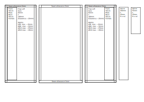
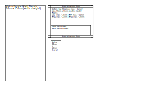

<!-- References -->
[iwtex]: https://www.iw-tex.de/
[tacticaltrim]: https://www.tacticaltrim.de/
[aktivstoffe]: https://www.aktivstoffe.de/
[extremtextil]: https://www.extremtextil.de/stoffe?p=26&limit=12

[iwtexmolle]: https://www.iw-tex.de/produkt/molle-pals-befestigung-mit-steg-5-x-2-steingrauoliv-gen-2/
[iwtexcordura]: https://www.iw-tex.de/produkt/560-dtex-cordura-pu-beschichtet-irr-steingrauoliv-meterware/

<!-- References: Repository -->
[home]: ./../README.md
[category_pouch]: ./../README.md
[category_magazine]: ./../README.md
[self]: ./README.md
<!-- References: Calculator -->
[calculator]: ./Calculator.html

<!-- Navigation -->
<a id="id_navigation" style="color: #dddddd; text-decoration:none">Navigation</a> 
[Home][home] &bullet; [Pouch][category_pouch] &bullet; [Magazine][category_magazine] &bullet; [Single (High Cut)][self]

<!-- Directory -->

Directory

&nbsp;&nbsp;&nbsp;&nbsp;&bullet;
<a href="#id_description" style="color: #dddddd; text-decoration: none"> Description</a>
<a href="#id_description" style="color: #dddddd; text-decoration: none">&#x21B4;</a>
 
&nbsp;&nbsp;&nbsp;&nbsp;&bullet;
<a href="#id_resources" style="color: #dddddd; text-decoration: none"> Resources</a>
<a href="#id_resources" style="color: #dddddd; text-decoration: none">&#x21B4;</a>
 
&nbsp;&nbsp;&nbsp;&nbsp;&bullet;
<a href="#id_templates" style="color: #dddddd; text-decoration: none"> Templates</a>
<a href="#id_templates" style="color: #dddddd; text-decoration: none">&#x21B4;</a>
 
&nbsp;&nbsp;&nbsp;&nbsp;&bullet;
<a href="#id_variations" style="color: #dddddd; text-decoration: none"> Variations</a>
<a href="#id_variations" style="color: #dddddd; text-decoration: none">&#x21B4;</a>
 
&nbsp;&nbsp;&nbsp;&nbsp;&bullet;
<a href="#id_calculator" style="color: #dddddd; text-decoration: none"> Calculator</a>
<a href="#id_calculator" style="color: #dddddd; text-decoration: none">&#x21B4;</a>
 

<!-- Description -->
<h2>
Magazine Pouch Multifit (High Cut)</a>
<a href="#id_navigation" style="color: #dddddd; text-decoration: none">&#x21B0;</a>
</h2>
</img> 
&#x26A0; Preview Image will be added soon

<!-- Resources -->
<h3>
<a id="id_resources" style="color: #dddddd; text-decoration: none">Resources</a>
<a href="#id_navigation" style="color: #dddddd; text-decoration: none">&#x21B0;</a>
</h3>
Materials for this Project where sourced from this Shops 
<a href="https://www.iw-tex.de/">IW-Tex</a> (https://www.iw-tex.de/) 
<a href="https://www.tacticaltrim.de/">Tacticaltrim</a> (https://www.tacticaltrim.de/) 

---
| [Molle Befestigung][iwtexmolle] | [Cordura Stoff][iwtexcordura] | Velcro Female(150mm) | Velcro Male(20mm) | Velcro Female(20mm)
| :- | :- | :- | :- | :-  
|  |  |  |  | 
| Used for the Backpanel | Used for the Frontpanel | Used for the Backpanel and Frontpanel Lining | Used on Back and Frontpanel to attach Frontpanel | Used on Frontpanel for attachment and size adjustment
---
*Sewing Thread is not listed

<!-- Templates -->
<h3>
<a id="id_templates" style="color: #dddddd; text-decoration: none">Cutting Templates</a>
<a href="#id_navigation" style="color: #dddddd; text-decoration: none;">&#x21B0;</a>
</h3>

Page 1 (Din-A4 Portrait)

</img>

Page 2 (Din-A4 Portrait)

</img>

<!-- Variations -->
<h3>
<a id="id_variations" style="color: #dddddd; text-decoration: none;">Possible Variations</a>
<a href="#id_navigation" style="color: #dddddd; text-decoration: none;">&#x21B0;</a>
</h3>
- For the Front Panels Sides and Bottom Flaps elastic fabric could be used to achieve more retention. 
- Separator to use for SMG-Magazines

<!-- Calculator -->
<h3>
<a id="id_calculator" style="color: #dddddd; text-decoration: none;">Material Cost Calculator</a>
<a href="#id_navigation" style="color: #dddddd; text-decoration: none;">&#x21B0;</a>
</h3>
Download the <a href="calculator.html">Calculator html</a> and open it with your browser to calculate the Cost of Materials used for this Piece of Gear. 