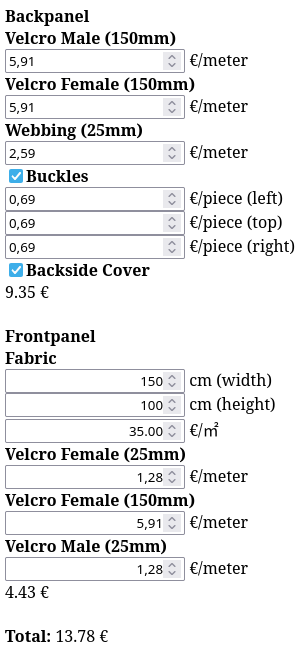

<!-- References: IW-Tex -->
[iwtex]: https://www.iw-tex.de/shop/
[iwtexmolle]: https://www.iw-tex.de/produkt/molle-pals-befestigung-mit-steg-5-x-2-steingrauoliv-gen-2/
[iwtexcordura]: https://www.iw-tex.de/produkt/560-dtex-cordura-pu-beschichtet-irr-steingrauoliv-meterware/
<!-- References: Tacticaltrim -->
[tacticaltrim]: https://www.tacticaltrim.de/
<!-- References: Aktivstoffe -->
[aktivstoffe]: https://www.aktivstoffe.de/
<!-- Referenecs: Extremtextil -->
[extremtextil]: https://www.extremtextil.de/stoffe?p=26&limit=12
<!-- References: Repository -->
[home]: ./../README.md
<!-- References: Categories -->
[category_placard]: ./../README.md
[category_magazine]: ./../README.md
[self]: ./README.md
[fabric]: ./README.md
[velcromale150mm]: ./../Resource/VelcroMale150mm.md
[velcrofemale150mm]: ./../Resource/VelcroFemale150mm.md
[velcromale25mm]: ./../Resource/VelcroMale25mm.md
[velcrofemale25mm]: ./../Resource//VelcroFemale25mm.md
[webbing25mm]: ./../Resource/Webbing25mm.md
[buckles]: ./../Resource/Buckles25mm.md
<!-- References: Calculator -->
[calculator]: ./calculator.html
<!-- Anchors -->
[id_navigation]: #id_navigation
[id_directory]: #id_directory
[id_description]: #id_description
[id_resources]: #id_resources
[id_templates]: #id_templates
[id_variations]: #id_variations
[id_calculator]: #id_calculator

<!-- Navigation -->
<a id="id_navigation" style="color: #dddddd; text-decoration:none">Navigation</a> 
[Home][home] &bullet; [Placard][category_placard] &bullet; [Magazine][category_magazine] &bullet; [Tripple (High Cut)][self]

<!-- Directory -->

Directory

&nbsp;&nbsp;&nbsp;&nbsp;&bullet;
<a href="#id_description" style="color: #dddddd; text-decoration: none"> Description</a>
<a href="#id_description" style="color: #dddddd; text-decoration: none">&#x21B4;</a>
 
&nbsp;&nbsp;&nbsp;&nbsp;&bullet;
<a href="#id_resources" style="color: #dddddd; text-decoration: none"> Resources</a>
<a href="#id_resources" style="color: #dddddd; text-decoration: none">&#x21B4;</a>
 
&nbsp;&nbsp;&nbsp;&nbsp;&bullet;
<a href="#id_templates" style="color: #dddddd; text-decoration: none"> Templates</a>
<a href="#id_templates" style="color: #dddddd; text-decoration: none">&#x21B4;</a>
 
&nbsp;&nbsp;&nbsp;&nbsp;&bullet;
<a href="#id_variations" style="color: #dddddd; text-decoration: none"> Variations</a>
<a href="#id_variations" style="color: #dddddd; text-decoration: none">&#x21B4;</a>
 
&nbsp;&nbsp;&nbsp;&nbsp;&bullet;
<a href="#id_calculator" style="color: #dddddd; text-decoration: none"> Calculator</a>
<a href="#id_calculator" style="color: #dddddd; text-decoration: none">&#x21B4;</a>
 

<!-- Description -->
<h2>
Placard Tripple-Mag (High Cut)</a>
<a href="#id_navigation" style="color: #dddddd; text-decoration: none">&#x21B0;</a>
</h2>
</img> &#x26A0; Preview Image will be added soon

This piece of Equipment is a modular Placard for use with Chestrigs and Platecarriers. It consits of a Backpanel and a Frontpanel. 
The Backpanel has male Velcro on the back and female Velcro on the front with sewed in looped webbing on the sides and on top to attach Buckles*. 
The Frontpanel is made of Fabric with additional Velcro to attach it on the Backpanel and to adjust for different Magazine Sizes. 

<!-- Resources -->
<h3>
<a id="id_resources" style="color: #dddddd; text-decoration: none">Resources</a>
<a href="#id_navigation" style="color: #dddddd; text-decoration: none">&#x21B0;</a>
</h3>
Materials for this Project where sourced from this Shops 
<a href="https://www.iw-tex.de/">IW-Tex</a> (https://www.iw-tex.de/) 
<a href="https://www.tacticaltrim.de/">Tacticaltrim</a> (https://www.tacticaltrim.de/) 

| [Fabric][fabric] | [Velcro Male 150mm][velcromale150mm] | [Velcro Female 150mm][velcrofemale150mm] | [Webbing 25mm][webbing25mm] | [Buckles][buckles] | [Velcro Male 25mm][velcromale25mm] | [Velcro Female 25mm][velcrofemale25mm]
| :- | :- | :- | :- | :- | :- | :- |
|  |  |  |  |  |  |  |
| Used for the Frontflap | Used for the Backpanel | Used for the Backpanel and Frontpanel Lining | Used for Buckles attachment | Used to attach to Chest Rig | Used to attach to Backpanel, for Frontpanel stability and lining to depart Magazines | Used to attach to Backpanel and Compression

<!-- Templates -->
<h3>
<a id="id_templates" style="color: #dddddd; text-decoration: none">Cutting Templates</a>
<a href="#id_navigation" style="color: #dddddd; text-decoration: none;">&#x21B0;</a>
</h3>

Page 1

</img>

Page 2

</img>

<!-- Variations -->
<h3>
<a id="id_variations" style="color: #dddddd; text-decoration: none;">Possible Variations</a>
<a href="#id_navigation" style="color: #dddddd; text-decoration: none;">&#x21B0;</a>
</h3>
&bullet; The Webbing on the Sides may be layouted differently to be used with other Quickrelease Systems (ROC, Tubes...). 
&bullet; The Surface on the Frontpanel may be used for additional Molle Webbing. 
&bullet; The Front- and Backpanel could have Holes or small Webbing to thread Shockcord for Open-Top Magazine retention. 
&bullet; The Velcro on the Insides of the  Front- and Backpanel can host Velcropatches with a rubberized Backface for Open-Top Magazine retention. 
&bullet; The Velcro on the Inside of the Backpanel and additional Velcro on the Frontpanel can host a Lid for Closed-Top Magazine retention.  
&bullet; The Frontpanels Sides and Bottom Flaps and Seperators can be made of elastic Fabric to increase Magazine retetion. 

<!-- Calculator -->
<h3>
<a id="id_calculator" style="color: #dddddd; text-decoration: none;">Material Cost Calculator</a>
<a href="#id_navigation" style="color: #dddddd; text-decoration: none;">&#x21B0;</a>
</h3>
Download the <a href="calculator.html">Calculator html</a> and open it with your browser to calculate the Cost of Materials used for this Piece of Gear. 
</img> 