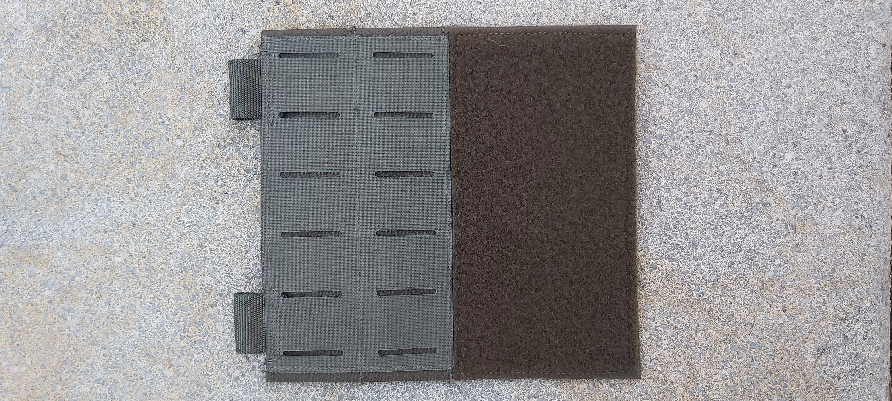
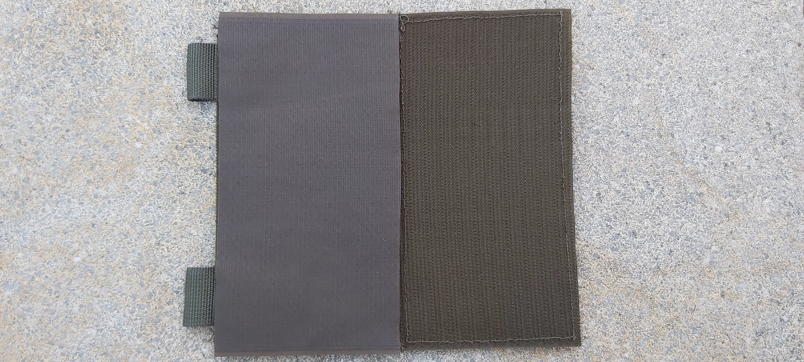
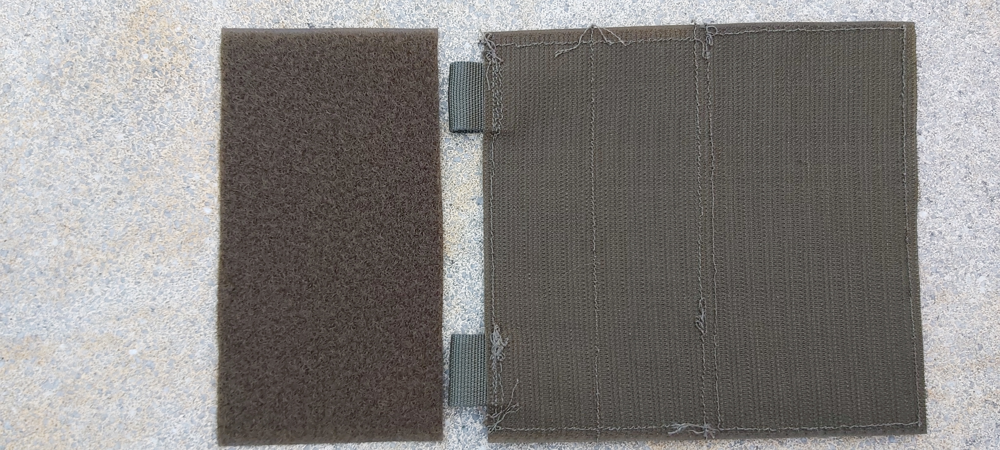
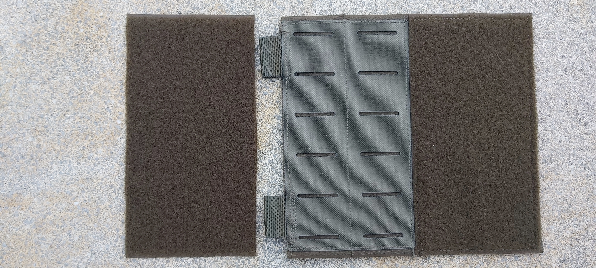

<!-- References: IW-Tex -->
[iwtex]: https://www.iw-tex.de/shop/
[iwtex_frontpanel]: https://www.iw-tex.de/produkt/front-panel-steingrauoliv-gen-2/
<!-- References: Tacticaltrim -->
[tacticaltrim]: https://www.tacticaltrim.de/
<!-- References: Aktivstoffe -->
[aktivstoffe]: https://www.aktivstoffe.de/
<!-- Referenecs: Extremtextil -->
[extremtextil]: https://www.extremtextil.de/stoffe?p=26&limit=12
<!-- References: Categories -->
[self]: ./README.md
[home]: ./../../README.md
[category_placard]: ./../../README.md
<!-- References: Resources -->
[velcromale150mm]: ./../Resource/VelcroMale150mm.md
[velcrofemale150mm]: ./../Resource/VelcroFemale150mm.md
[webbing25mm]: ./../Resource/Webbing25mm.md
<!-- References: Calculator -->
[calculator]: ./calculator.html
<!-- Anchors -->
[id_navigation]: #id_navigation
[id_directory]: #id_directory
[id_description]: #id_description
[id_resources]: #id_resources
[id_templates]: #id_templates
[id_variations]: #id_variations
[id_calculator]: #id_calculator

<!-- Navigation -->
<a id="id_navigation" style="color: #dddddd; text-decoration:none">Navigation</a> 
[Home][home] &bullet; [Placard][category_placard] &bullet; [Molle Wing][self]

<!-- Directory -->

Directory

&nbsp;&nbsp;&nbsp;&nbsp;&bullet;
<a href="#id_description" style="color: #dddddd; text-decoration: none"> Description</a>
<a href="#id_description" style="color: #dddddd; text-decoration: none">&#x21B4;</a>
 
<!--
&nbsp;&nbsp;&nbsp;&nbsp;&bullet;
<a href="#id_resources" style="color: #dddddd; text-decoration: none"> Resources</a>
<a href="#id_resources" style="color: #dddddd; text-decoration: none">&#x21B4;</a>
 
&nbsp;&nbsp;&nbsp;&nbsp;&bullet;
<a href="#id_templates" style="color: #dddddd; text-decoration: none"> Templates</a>
<a href="#id_templates" style="color: #dddddd; text-decoration: none">&#x21B4;</a>
 
&nbsp;&nbsp;&nbsp;&nbsp;&bullet;
<a href="#id_variations" style="color: #dddddd; text-decoration: none"> Variations</a>
<a href="#id_variations" style="color: #dddddd; text-decoration: none">&#x21B4;</a>
 
&nbsp;&nbsp;&nbsp;&nbsp;&bullet;
<a href="#id_calculator" style="color: #dddddd; text-decoration: none"> Calculator</a>
<a href="#id_calculator" style="color: #dddddd; text-decoration: none">&#x21B4;</a>
 
-->

<!-- Description -->
<h2>
Placard Molle Wing</a>
<a href="#id_navigation" style="color: #dddddd; text-decoration: none">&#x21B0;</a>
</h2>

 
This piece of equipment is a modular Wing to scale up Chestrigs with Placards 
It is made of a full male Velcro Patch hosting a Molle Panel and female Velcro Patch on the Frontside. 
The Webbin0g Loops on the side may host Buckles or D-Rings to attach or stabilize Chestrig-Webbing 
The Molle Wing velcros in between the backside and cover of any Placard 

<!--
This piece of Equipment is a modular Placard for use with Chestrigs and Platecarriers. It consists of a single Molle Panel with 6 Molle-Collumns and 5 Molle Rows. 
The Backside is made of Male Velcro to attach to Platecarriers or to be covered by a Female Velcro Patch if used with Chestrigs. 
The Webbing Loops on top velcro onto the Backside Velcro to hold Buckles or be looped into Molle with Velcro Surface. 
The Webbing Loops on the sides hold Buckles to attach to Chestrigwebbing or Cummerbunds. 
- Usable with Chestrig/Platecarrier 
- 6 Molle Collumns / 5 Molle Rows 
- Scalable with Sidepanels 
-->

<!-- Resources -->
<!--
<h3>
<a id="id_resources" style="color: #dddddd; text-decoration: none">Resources</a>
<a href="#id_navigation" style="color: #dddddd; text-decoration: none">&#x21B0;</a>
</h3>
Materials for this Project where sourced from this Shops 
<a href="https://www.iw-tex.de/">IW-Tex</a> (https://www.iw-tex.de/) 
<a href="https://www.tacticaltrim.de/">Tacticaltrim</a> (https://www.tacticaltrim.de/) 

| [Front Panel][iwtex_frontpanel] | [Velcro Male 150mm][velcromale150mm] | [Velcro Female 150mm][velcrofemale150mm] | [Velcro Female 20mm][velcrofemale20mm] | [Webbing 25mm][webbing25mm] | [Buckles][buckles] |
| :- | :- | :- | :- | :- | :- |
|  |  |  |  |  |  |
| Molle Panel on Frontside with top Webbing | Used for the Backside Velcro | Used for the Backside Cover | Used for Molle Panel top Webbing | Used for attaching Buckles on Sides | Used to attach Plackard | 

*Sewing Thread is not listed
-->

<!-- Templates -->
<!--
<h3>
<a id="id_templates" style="color: #dddddd; text-decoration: none">Cutting Templates</a>
<a href="#id_navigation" style="color: #dddddd; text-decoration: none;">&#x21B0;</a>
</h3>

Page 1

</img>

-->

<!-- Variations -->
<!--
<h3>
<a id="id_variations" style="color: #dddddd; text-decoration: none;">Possible Variations</a>
<a href="#id_navigation" style="color: #dddddd; text-decoration: none;">&#x21B0;</a>
</h3>
&bullet; The Webbing on the Sides may be layouted differently to be used with other Quickrelease Systems (ROC, Tubes...). 
&bullet; The Webbing on top of the Molle Panel could host Female Velcro on the inside as described and additionally Male Velcro on the outside for extra stability. 
-->

<!-- Calculator -->
<!--
<h3>
<a id="id_calculator" style="color: #dddddd; text-decoration: none;">Material Cost Calculator</a>
<a href="#id_navigation" style="color: #dddddd; text-decoration: none;">&#x21B0;</a>
</h3>
Download the <a href="calculator.html">Calculator html</a> and open it with your browser to calculate the Cost of Materials used for this Piece of Gear. 
</img> 
-->