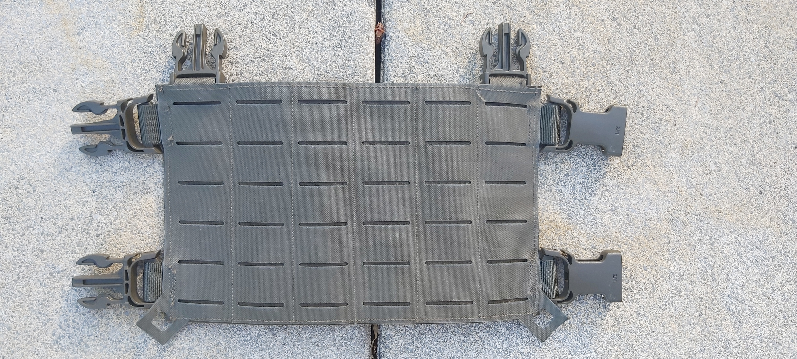

<!-- References -->
[ref_magpouchplacardmultifittripple]: ./Magazine%20Pouch%20Placard%20Multifit%20Tripple/README.md
[ref_magpouchmultifit]: ./Magazine%20Pouch%20Multifit/README.md

# DIY - Custom Tactical Equipment
This Project provides Guides and Templates to make your own Tactical Equipment.
The premise is to create minimalistic, lightweight and modular pieces of Equipment made of durable and affordable Materials to cover essential needs for outdoor Sportsgames like Airsoft or Paintball.

<!--

Directory

&nbsp;&nbsp;&nbsp;&nbsp;&bullet; Placard 
&nbsp;&nbsp;&nbsp;&nbsp;&nbsp;&nbsp;&nbsp;&nbsp;&bullet; Magazine 
&nbsp;&nbsp;&nbsp;&nbsp;&nbsp;&nbsp;&nbsp;&nbsp;&nbsp;&nbsp;&nbsp;&nbsp;&bullet; Tripple (High-Cut) 
&nbsp;&nbsp;&nbsp;&nbsp;&nbsp;&nbsp;&nbsp;&nbsp;&nbsp;&nbsp;&nbsp;&nbsp;&bullet; Tripple (Low-Cut) 
&nbsp;&nbsp;&nbsp;&nbsp;&nbsp;&nbsp;&nbsp;&nbsp;&bullet; Panel 
&nbsp;&nbsp;&nbsp;&nbsp;&bullet; Pouch 

-->

<!-- Placard Front Panel Molle -->
[asset_placard_mollepanel]: ./Placard/Molle/README.md
## [Placard - Molle Panel][asset_placard_mollepanel]

<!-- Placard Magazine Multifit Tripple -->
## [Placard - Multifit Tripple Magazine][ref_magpouchplacardmultifittripple]

<!-- Magazine Pouch Multifit Single -->
## [Pouch - Multifit Single Magazine ][ref_magpouchmultifit]

<!-- Changelog 

Changelog

-->